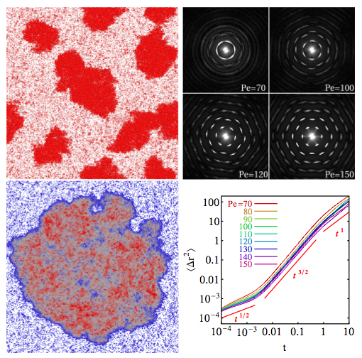

# Joakim' PRL

## Supplementary Materials

Apparently the cut-off shifted Lennard-Jones potential is 'Weeks-Chandler-Andersen' potential,

$U = 4 \epsilon \left[ (\sigma / r)^{12} - (\sigma / r)^6 \right] + \epsilon \quad,\quad r < 2^{1/6} \sigma$

$U = 0 \quad \mathrm{otherwise}$

Microscopic dynamics performed in LAMMPS is equivalent to,

$\partial_t \mathbf{r}_i = \beta \mathrm{D} (\mathbf{F}_i + F_p \mathbf{p}_i) + \sqrt{2 D} \mathbf{\Lambda}_\mathbf{r}$

First term is inter-particle force; second is self-propulsive; third is diffusive translational noise.

$\partial_t \theta_i = \sqrt{2 D_r} \Lambda_\theta$

Have just rotational diffusion. Note, this is the bit I'm meant to be changing.

The microscopic particle speed is defined as:

$v_i = \beta D (\mathbf{F}_i + F_p \mathbf{p}_i) \cdot \mathbf{p}_i$

so the projection of the actual displacement speed onto the self-propulsion direction.

The system diffusivity is measured by fitting to the long-time limit of the mean squared displacement against time.

The characteristic domain scale $L(t)$ was computed as the inverse of the first moment of the structure factor $S(k, t)$. The structure factor is essentially the fourier transform of the particle coordinates, I think. The first moment just means to integrate over all frequencies $k$, weighted by $k$. Same as calculating the mean.

To coarse-grain the particle coordinates to a field, looking at all particles to generate the density of a particular lattice point, and weighting by 

$w(r) = \exp{\left[\dfrac{−{r_\mathrm{cut}}^2}{{r_\mathrm{cut}}^2 − r^2}\right]}$.

This seems to be written wrong in detail but it's a gaussian envelope, you get the idea.

Used 256 lattice points to make the density field, and chose $r_\mathrm{cut} = \dfrac{\sqrt{2} L}{256}$.

# Redner, Hagan, Baskaran

From lower-right image above, can see diffusivity obeys $\alpha = 0.5$ at small times; $\alpha = 1.5$ at intermediate times, and $\alpha = 1$ at large times.

Useful note: hard sphere close packing limit, $\phi_\mathrm{cp} = \dfrac{\pi}{2 \sqrt{3}}$.

Simulated from $\mathrm{Pe}=0$ to $\mathrm{Pe=150}$.

# Fily, Marchetti
